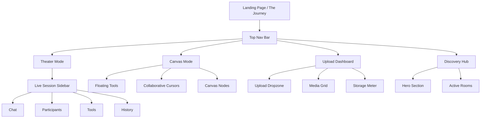
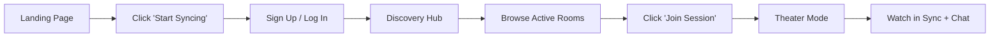
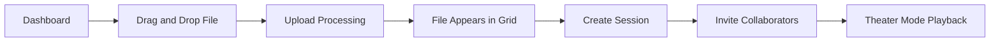
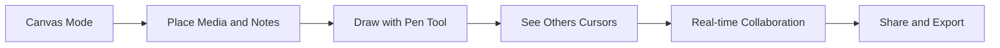

# SyncStream Canvas — Product Requirements Document (PRD)

> **Version:** 1.0  
> **Date:** August 17, 2026  
> **Derived From:** Stitch Project `17540314284874410208` (Desktop — "Obsidian Flow" Design System)  
> **Status:** Draft — Pending Review

---

## 1. Product Overview

### 1.1 Vision

SyncStream is a **high-fidelity, real-time collaborative media platform** that combines cinematic-quality synchronized video playback, an infinite collaborative canvas, media asset management, and social discovery — all in a single desktop web application.

The core value proposition is **"Full HD, 0% Blur"**: instead of degraded screen-sharing via UDP, SyncStream requires users to pre-upload media assets and then synchronizes playback state across all connected clients at native resolution, frame-accurately.

### 1.2 Target Audience

- **Creative professionals** (filmmakers, designers, producers) reviewing high-resolution assets collaboratively
- **Development teams** conducting real-time UI/UX architecture reviews and pair-design sessions
- **Communities** hosting watch parties, film clubs, and audio mixing sessions at scale (up to 12,000+ concurrent viewers)

### 1.3 Brand & Design Identity

| Attribute | Value |
|---|---|
| **Design System** | "Obsidian Flow" — Cyber-Minimalist Glassmorphism |
| **Brand Personality** | High-Performance Luxury |
| **Color Mode** | Dark |
| **Primary Color** | Electric Blue (`#3B82F6` / `#ADC6FF`) |
| **Secondary Color** | Vivid Violet (`#8B5CF6` / `#D0BCFF`) |
| **Tertiary Color** | Cyan Glow (`#4CD7F6`) |
| **Base Surface** | Obsidian Black (`#050505`) / Midnight Navy (`#0A0A0F`) |
| **Typography** | Headlines: **Geist** · Body: **Inter** · Technical/Mono: **JetBrains Mono** |
| **Device Target** | Desktop-first (1280×1024 primary viewport), responsive down to mobile |

---

## 2. Information Architecture & Screens

The application is organized into **four core modules**, accessible via a persistent top navigation bar. An additional **marketing/landing page** serves as the product homepage.

---

## 3. Feature Requirements

### 3.1 Global Navigation

| ID | Requirement | Priority |
|---|---|---|
| NAV-01 | Fixed top navigation bar with glassmorphic blur (`backdrop-blur-xl`), semi-transparent background (`bg-surface/70`), and subtle bottom border | P0 |
| NAV-02 | SyncStream brand logo (Geist, headline-md, tight tracking, primary color) on the left | P0 |
| NAV-03 | Navigation links: **Theater**, **Canvas**, **Dashboard**, **Discovery** — monospaced labels (`JetBrains Mono`, 12px), active state with primary underline | P0 |
| NAV-04 | Trailing icons: Notifications, Settings (Material Symbols Outlined) | P1 |
| NAV-05 | User avatar (circular, 32px, bordered) | P0 |
| NAV-06 | Mobile bottom navigation bar (pill-shaped, backdrop-blur, with Mic, Camera, Share, Leave actions) | P1 |

---

### 3.2 Theater Mode (Synchronized Video Playback)

> **Screen Reference:** "SyncStream Theater — Minimal", "SyncStream Theater — Refined Minimal"

**Purpose:** The primary content consumption experience — a cinematic, synchronized video player with a live session sidebar.

#### 3.2.1 Video Player

| ID | Requirement | Priority |
|---|---|---|
| THR-01 | Full-width 16:9 aspect-ratio video container, max width 1200px, centered in main area | P0 |
| THR-02 | Rounded corners (`rounded-xl`), ring border (`ring-1 ring-white/10`), deep shadow | P0 |
| THR-03 | Gradient overlay at bottom (transparent → 80% black) for control legibility | P0 |
| THR-04 | Floating glass controls bar — appears on hover, slides up with `translate-y` animation | P0 |
| THR-05 | Controls: Play/Pause button, progress bar with timecodes (monospaced), volume icon, HD quality badge, fullscreen toggle | P0 |
| THR-06 | Progress bar glow effect (`shadow-[0_0_10px]`), color shift on hover (primary → tertiary) | P1 |
| THR-07 | Reveal animation on load (`scale(0.95)` → `scale(1)`, 0.8s cubic-bezier) | P2 |

#### 3.2.2 Live Session Sidebar

| ID | Requirement | Priority |
|---|---|---|
| SB-01 | Fixed left sidebar, 320px width, full height, glassmorphic background with backdrop-blur | P0 |
| SB-02 | Session header: "Live Session" title, live member count with pulsing indicator dot (`animate-pulse`, glow shadow) | P0 |
| SB-03 | "Invite" CTA button with gradient fill (primary → secondary) | P0 |
| SB-04 | Tab navigation: **Chat**, **Participants**, **Tools**, **History** — icon + label, active state with primary underline and tinted background | P0 |
| SB-05 | Chat area: scrollable message list, usernames color-coded by role (tertiary for system, secondary for users), glass-panel message bubbles | P0 |
| SB-06 | Chat input: dark background (`#020202`), bottom-border glow on focus (primary color), send button | P0 |
| SB-07 | Custom thin scrollbar (4px, transparent track, white/10 thumb) | P2 |

---

### 3.3 Canvas Mode (Infinite Collaborative Workspace)

> **Screen Reference:** "SyncStream Canvas — Clean Grid"

**Purpose:** A Figma/Miro-like infinite canvas for collaborative creation — sketching, annotation, media placement, and note-taking over a shared workspace.

| ID | Requirement | Priority |
|---|---|---|
| CVS-01 | Infinite pannable canvas with dot-grid background (50px grid, subtle 5% opacity lines) | P0 |
| CVS-02 | Parallax grid movement (grid moves at 0.5× speed relative to content during pan) | P1 |
| CVS-03 | Crosshair cursor by default, `grabbing` cursor during drag | P1 |
| CVS-04 | **Media Nodes**: Draggable cards with glassmorphic border, rounded corners, image thumbnail with hover overlay showing filename | P0 |
| CVS-05 | **Note Nodes**: Glass-panel cards with headline, body text, author attribution, and timestamp in monospaced font | P0 |
| CVS-06 | **SVG Sketch Elements**: Freeform drawing paths and shapes (arrows, circles) rendered as SVG overlays | P1 |
| CVS-07 | **Collaborative Cursors**: Real-time colored cursor indicators for each connected user (arrow icon + name label). Each user gets a unique accent color (Tertiary/Cyan, Secondary/Violet, etc.) | P0 |
| CVS-08 | Cursor labels: glass-panel background, monospaced font, colored border matching cursor | P0 |

#### 3.3.1 Floating Tools Sidebar

| ID | Requirement | Priority |
|---|---|---|
| TLS-01 | Fixed left-centered vertical toolbar, glassmorphic panel, rounded-2xl | P0 |
| TLS-02 | Tools: **Pen**, **Text**, **Media**, **Note**, **Shapes** — each with icon, tooltip on hover, active glow state | P0 |
| TLS-03 | Active tool: border glow (`border-primary/50`, `box-shadow` bloom), white text | P0 |
| TLS-04 | Divider line between drawing tools and shape tools | P2 |

#### 3.3.2 Session Controls (Bottom Bar)

| ID | Requirement | Priority |
|---|---|---|
| SC-01 | Centered floating pill-shaped bottom bar (desktop) with: **Mic**, **Camera**, **Share**, **Leave** (error color) | P0 |
| SC-02 | Glassmorphic background with violet glow shadow, scale-up hover on icons | P1 |

---

### 3.4 Upload Dashboard (Media Asset Management)

> **Screen Reference:** "SyncStream Dashboard — Performance Focused"

**Purpose:** Manage, upload, and browse all media assets in the user's library. This is the gateway to adding content for Theater playback.

| ID | Requirement | Priority |
|---|---|---|
| DSH-01 | Page header: "Upload Dashboard" title in headline-lg with primary glow text | P0 |
| DSH-02 | **Storage meter**: Compact card showing used/total storage (e.g., "45GB / 100GB"), gradient progress bar with glow | P0 |
| DSH-03 | **Upload dropzone**: Dashed-border card (primary/30), centered add icon with scaling hover animation and bloom glow, "Drag & drop or click to browse" label, supported formats (MP4, MOV, ProRes up to 10GB) in monospaced text | P0 |
| DSH-04 | **Media grid**: Responsive card grid (1–3 columns), 16:9 aspect-ratio thumbnails with hover reveal overlay (gradient + filename + file size + last played timestamp) | P0 |
| DSH-05 | Cards: `bloom-hover` effect (primary glow shadow on hover, border color change), scale-up image transform on hover | P1 |
| DSH-06 | 12-column grid layout: Upload dropzone occupies 3 columns, media grid occupies 9 columns | P0 |

---

### 3.5 Discovery Hub (Social Discovery & Watch Parties)

> **Screen Reference:** "SyncStream Discovery — Immersive Cards"

**Purpose:** A social discovery feed where users find trending content, browse active live rooms, and join watch parties.

#### 3.5.1 Hero Section

| ID | Requirement | Priority |
|---|---|---|
| DSC-01 | Full-bleed hero image (614–716px height) with gradient overlay (bottom → opaque) | P0 |
| DSC-02 | "Trending Now" badge: pill-shaped, error color with pulsing dot, uppercase caps label | P0 |
| DSC-03 | Hero title in display-lg (64px, Geist, 800 weight, glow text) | P0 |
| DSC-04 | Participant count and description in body-lg | P0 |
| DSC-05 | CTA buttons: "JOIN SESSION" (gradient primary→secondary fill, pill) and "DETAILS" (ghost/glass border) | P0 |
| DSC-06 | **Live Preview Card** (desktop only, 400px): Glass-panel with video thumbnail, "LIVE" badge, stacked user avatars with overlap styling (+42 count badge), "Syncing..." status | P1 |

#### 3.5.2 Active Rooms Grid

| ID | Requirement | Priority |
|---|---|---|
| DSC-07 | Section header: "Active Rooms" headline with "VIEW ALL →" link | P0 |
| DSC-08 | 3-column responsive grid of room cards | P0 |
| DSC-09 | Room cards: Glass-card styling (#0A0A0F background, 0.5px border), hover with primary glow, -2px translateY, and border color change | P0 |
| DSC-10 | Card content: 16:9 cover image (opacity transition on hover), category badge (colored by type: DEV SYNC/tertiary, FILM CLUB/secondary, AUDIO MIX/primary), live user count with red dot | P0 |
| DSC-11 | Card metadata: Room name, description (2-line clamp), host avatar + username | P0 |
| DSC-12 | Scroll-triggered reveal animation (opacity 0 → 1, translateY 30px → 0, 0.8s ease-out) | P1 |

---

### 3.6 Landing Page / Marketing ("The Journey")

> **Screen Reference:** "SyncStream — The Journey"

**Purpose:** A long-scrolling marketing/storytelling page that explains SyncStream's value proposition. Includes an animated WebGL shader background.

| ID | Requirement | Priority |
|---|---|---|
| LND-01 | Fixed fullscreen WebGL shader background (deep-space nebula animation with flowing noise, violet/blue tones, distant stars) | P1 |
| LND-02 | "Get Started" CTA button in nav (gradient primary-container → secondary-container) | P0 |
| LND-03 | **Hero section**: "High Fidelity Collaboration." in display-lg (80px), glow-text, with "START SYNCING" (primary fill) and "WATCH DEMO" (glass-panel) CTAs | P0 |
| LND-04 | **Problem section** ("01 / The Problem"): Side-by-side layout explaining UDP compression issues. Includes a diagnostic glass-panel with "UDP STREAM DETECTED" error indicator and bar visualization. Blurred "720p" typography to illustrate degradation | P0 |
| LND-05 | **Solution section** ("02 / The Solution"): Side-by-side layout showcasing "4K NATIVE RESOLUTION" with primary-colored glow text. Feature checklist: Lossless Playback, Frame-Accurate Sync | P0 |
| LND-06 | Intersection Observer-driven fade-in animations (opacity + translateY, 1s cubic-bezier) | P1 |
| LND-07 | Footer: Brand name, copyright, links (Privacy, Terms, Security, Support) in label-caps | P0 |

---

## 4. Design System Specifications

### 4.1 Elevation Model (No Drop Shadows)

| Level | Usage | Implementation |
|---|---|---|
| **Level 0** | Base background | `#050505` pure black |
| **Level 1** | Cards, surfaces | `#0A0A0F` with 0.5px solid border (`rgba(255,255,255,0.1)`) |
| **Level 2** | Floating glass panels | `backdrop-blur(30px)` + `rgba(15, 15, 20, 0.7)` fill |
| **Level 3** | Popovers, modals | `backdrop-blur(50px)` + primary outer glow at 10% opacity |

### 4.2 Interactive States

| State | Effect |
|---|---|
| **Hover (Buttons)** | "Outer Bloom" — border brightens, `box-shadow: 0 0 20px rgba(59, 130, 246, 0.3)` |
| **Hover (Cards)** | Border → primary/30, translateY(-2px), glow shadow |
| **Focus (Inputs)** | Bottom border glows primary, faint blue wash fill |
| **Active (Nav)** | Primary text + 2px bottom border + slight scale |
| **Live indicators** | CSS pulse animation (`opacity 1.0 → 0.4`), breathing dot |

### 4.3 Typography Scale

| Token | Family | Size | Weight | Tracking |
|---|---|---|---|---|
| `display-lg` | Geist | 64px | 800 | -0.04em |
| `headline-lg` | Geist | 40px | 700 | -0.02em |
| `headline-md` | Geist | 24px | 600 | — |
| `body-lg` | Inter | 18px | 400 | — |
| `body-md` | Inter | 16px | 400 | — |
| `label-caps` | Inter | 11px | 700 | 0.1em |
| `label-mono` | JetBrains Mono | 12px | 500 | 0.05em |

### 4.4 Spacing (4px Baseline)

| Token | Value | Usage |
|---|---|---|
| `unit` | 4px | Base unit |
| `stack-xs` | 4px | Tight stacking |
| `stack-sm` | 8px | Small gaps |
| `stack-md` | 16px | Standard spacing |
| `stack-lg` | 32px | Section gaps |
| `stack-xl` | 64px | Major sections |
| `gutter` | 24px | Grid gutters |
| `margin` | 40px | Container margins |
| `container-max` | 1440px | Max content width |

---

## 5. Technical Architecture Considerations

### 5.1 Core Technologies (from design)

| Layer | Technology |
|---|---|
| **Styling** | TailwindCSS (CDN with custom config) |
| **Icons** | Google Material Symbols Outlined (variable font) |
| **Fonts** | Google Fonts: Geist, Inter, JetBrains Mono |
| **Graphics** | WebGL (shader backgrounds), SVG (canvas elements) |
| **Animations** | CSS transitions, `@keyframes`, Intersection Observer API |

### 5.2 Key Technical Requirements

| ID | Requirement | Notes |
|---|---|---|
| TECH-01 | Real-time synchronized playback state across all clients | WebSocket / WebRTC data channel |
| TECH-02 | Pre-upload media pipeline supporting MP4, MOV, ProRes up to 10GB | Cloud storage + transcoding service |
| TECH-03 | Infinite canvas with pan/zoom and real-time cursor broadcasting | Custom canvas engine or library (e.g., tldraw, Excalidraw) |
| TECH-04 | Real-time chat with user presence and typing indicators | WebSocket |
| TECH-05 | Multi-user cursor synchronization with sub-100ms latency | CRDT or OT-based state sync |
| TECH-06 | Glassmorphic UI rendering at 60fps across modern browsers | `backdrop-filter` support required; fallback for unsupported |
| TECH-07 | WebGL shader rendering for background animations | Canvas 2D fallback for low-power devices |

---

## 6. User Flows

### 6.1 Primary Flow: Join a Watch Party

### 6.2 Primary Flow: Upload & Share Media

### 6.3 Primary Flow: Collaborative Canvas Session

---

## 7. Success Metrics

| Metric | Target | Rationale |
|---|---|---|
| **Playback Sync Accuracy** | < 50ms drift across clients | Core value prop: frame-accurate |
| **Upload Success Rate** | > 99% for files < 10GB | Reliability of the pre-upload model |
| **Concurrent Viewers per Room** | 500+ (stretch: 12,000+) | Competitive with Twitch/Discord watch parties |
| **Canvas Cursor Latency** | < 100ms round-trip | Real-time collaboration feel |
| **Time to First Meaningful Paint** | < 2.0s | Premium feel requires fast load |
| **DAU Engagement** | > 15 min avg session | Content + social stickiness |

---

## 8. Out of Scope (v1)

- Mobile-native applications (iOS/Android) — responsive web only
- Video editing / trimming within the platform
- Monetization / subscription billing
- Content moderation / NSFW detection
- Offline playback / download
- User-generated shader backgrounds

---

## 9. Open Questions

> [!IMPORTANT]
> The following decisions need input before implementation begins:

1. **Authentication**: Which auth provider? (Firebase Auth, Auth0, custom OAuth?)
2. **Real-time infrastructure**: WebSocket server (custom Node.js, Socket.io) vs managed service (Ably, Pusher, Firebase Realtime)?
3. **Media storage & CDN**: Cloud storage backend (GCS, S3, Cloudflare R2)? Transcoding pipeline for ProRes?
4. **Canvas engine**: Build custom vs integrate existing (tldraw, Excalidraw core)?
5. **Frontend framework**: The Stitch designs are static HTML — what framework for production? (Next.js, SvelteKit, plain Vite + React?)
6. **Algorithm Visualization tie-in**: Per `ideas.txt`, this project should demonstrate algorithm visualization. Should the Canvas mode include a pathfinding / sorting algorithm visualizer as a Canvas "tool" type?
