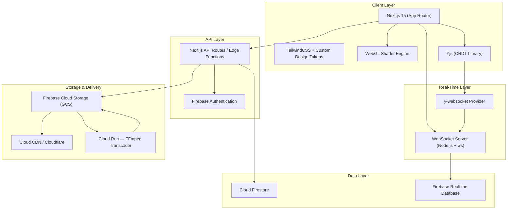
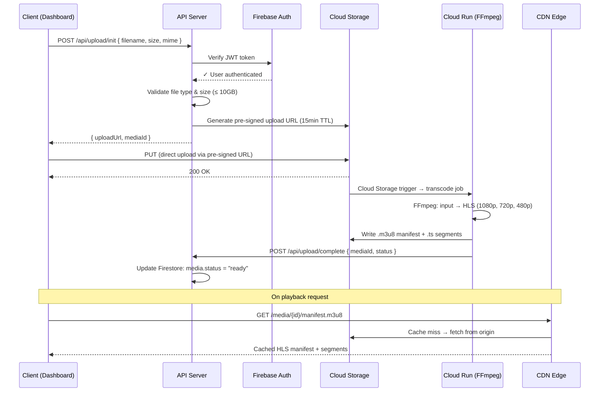
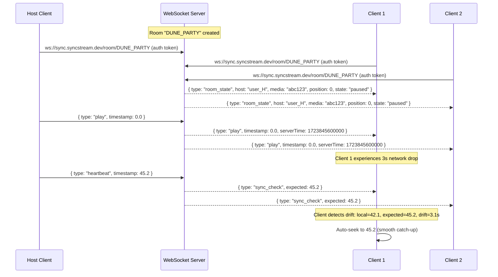
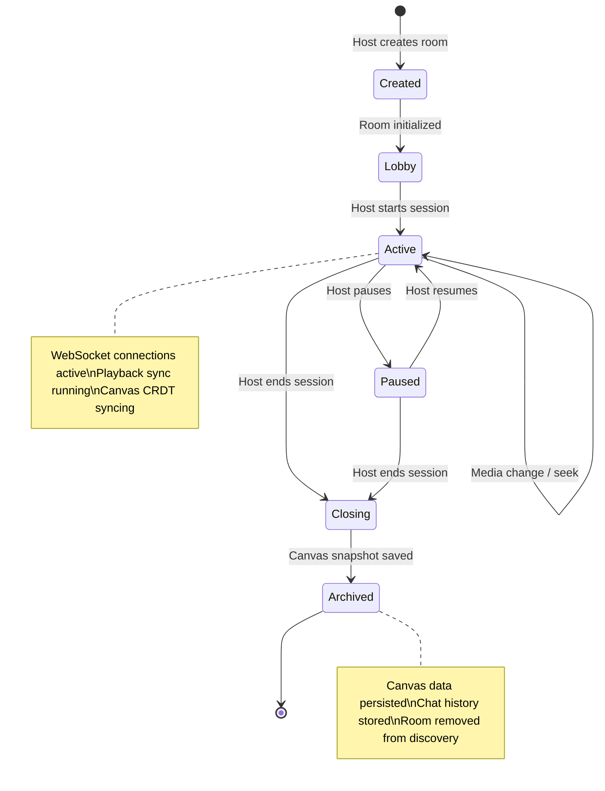
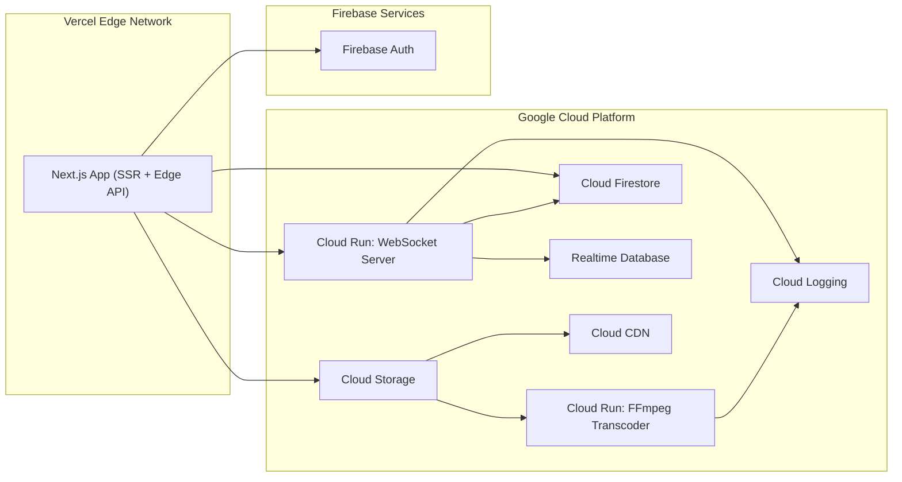

# SyncStream Canvas — Technical Design Document (TDD)

> **Version:** 1.0  
> **Date:** August 17, 2026  
> **Companion To:** [PRD.md](file:///c:/dev/New%20folder/PRD.md)  
> **Status:** Draft — Pending Review

---

## 1. Executive Summary

This document details **how** every product requirement in the PRD will be met at the systems level. It defines the technology stack, system architecture, data flows, security posture, and performance constraints for SyncStream Canvas — a real-time collaborative media platform.

The architecture is designed around **five core subsystems**, each addressing a distinct technical challenge:

| # | Subsystem | Challenge Addressed |
|---|---|---|
| 1 | Video Upload & Delivery | Handling heavy data (10GB files) without choking the API |
| 2 | Playback Synchronization | Frame-accurate sync across thousands of clients |
| 3 | Collaborative Canvas | High-concurrency real-time edits without conflicts |
| 4 | API & Room Management | Structural data, auth, and session lifecycle |
| 5 | UI/UX Performance Layer | 60fps glassmorphism + WebGL + video + WebSocket simultaneously |

---

## 2. Technology Stack

### 2.1 Stack Overview



### 2.2 Stack Decisions

| Layer | Technology | Rationale |
|---|---|---|
| **Frontend Framework** | Next.js 15 (App Router) | SSR for landing/marketing pages (SEO), client components for app modules. React ecosystem for component reuse. |
| **Styling** | TailwindCSS v4 + custom config | Direct match to Stitch design output. Design tokens (Obsidian Flow) map 1:1 to Tailwind `extend` config. |
| **Icons** | Google Material Symbols (variable font) | Already used in all Stitch screens. Variable `FILL`/`wght` support. |
| **Fonts** | Google Fonts: Geist, Inter, JetBrains Mono | Direct from design system spec. Preconnect + `display=swap` for performance. |
| **Authentication** | Firebase Authentication | Google, GitHub, email/password providers. JWT tokens for WebSocket auth. |
| **REST API** | Next.js API Routes (Edge) | Co-located with frontend. Edge runtime for low-latency pre-signed URL generation. |
| **Real-Time Sync** | Custom WebSocket server (Node.js + `ws`) | Full control over room lifecycle, sync protocol, and backpressure. Deployed on Cloud Run (min 1 instance). |
| **Persistent Data** | Cloud Firestore | Room metadata, user profiles, media library. Strong consistency + real-time listeners for presence. |
| **Real-Time Broadcast** | Firebase Realtime Database | Lightweight pub/sub for playback state (`play`, `pause`, `seek` events). Lower latency than Firestore for high-frequency writes. |
| **Canvas CRDT** | Yjs + y-websocket | Industry-standard CRDT library. Powers collaborative canvas state (nodes, drawings, notes) without OT complexity. |
| **Object Storage** | Firebase Cloud Storage (backed by GCS) | Pre-signed URL uploads. Security rules for per-user access. Lifecycle policies for temp files. |
| **CDN** | Cloud CDN (or Cloudflare) | Edge-cached video chunks. HLS/DASH adaptive streaming delivery. |
| **Transcoding** | Cloud Run + FFmpeg | On-upload trigger: transcode ProRes/MOV → HLS (multi-bitrate). Containerized, scales to zero. |
| **WebGL** | Raw WebGL + custom GLSL shaders | Shader backgrounds from Stitch. No Three.js overhead — lightweight fullscreen quad rendering. |
| **Deployment** | Vercel (frontend) + Cloud Run (WebSocket + transcoder) | Vercel for Next.js edge deployment. Cloud Run for stateful WebSocket and batch transcoding. |

#### Why Firebase?
Firebase was chosen as the primary backend-as-a-service (BaaS) for several critical reasons:
1. **Real-time Database Ecosystem:** SyncStream requires both persistent metadata (Firestore) and extremely low-latency ephemeral state for presence and syncing (Realtime Database). Firebase offers both out of the box.
2. **Pre-signed Uploads & Security:** Firebase Cloud Storage integrates seamlessly with Firebase Auth and Security Rules, allowing us to generate pre-signed upload URLs and enforce strict 10GB limits without routing traffic through our own API server.
3. **Emulator Suite:** The Firebase Local Emulator Suite allows for comprehensive local development and CI testing of security rules and data flows without needing a live cloud environment.
4. **Speed to Market:** It eliminates the need to build custom authentication flows, session management, and basic database CRUD APIs, allowing us to focus engineering effort on the complex WebGL, CRDT, and Video Synchronization logic.

---

## 3. System Architecture — Subsystem Deep Dives

### 3.1 Subsystem 1: Video Upload & Delivery

> **PRD Requirements Addressed:** DSH-01 through DSH-06, THR-01 through THR-07, TECH-01, TECH-02

> [!CAUTION]
> **Never route raw video files through the API server.** A single 10GB ProRes upload would exhaust memory and block all other requests. All uploads MUST go direct-to-storage via pre-signed URLs.

#### 3.1.1 Upload Flow



#### 3.1.2 Storage Structure

```
gs://syncstream-media/
├── uploads/
│   └── {userId}/
│       └── {mediaId}/
│           └── original.{ext}          ← Raw upload (lifecycle: delete after 7d)
├── processed/
│   └── {mediaId}/
│       ├── manifest.m3u8              ← HLS master playlist
│       ├── 1080p/
│       │   ├── segment_000.ts
│       │   └── ...
│       ├── 720p/
│       │   └── ...
│       └── 480p/
│           └── ...
└── thumbnails/
    └── {mediaId}/
        ├── poster.webp                ← 16:9 poster frame
        └── preview.webp               ← Hover preview strip
```

#### 3.1.3 Security Constraints

| Vulnerability | Mitigation |
|---|---|
| **Unrestricted file upload (OWASP A04)** | Server-side validation of MIME type + magic bytes. Allowlist: `video/mp4`, `video/quicktime`, `video/x-msvideo`, `application/mxf`. Max size enforced in pre-signed URL policy. |
| **Path traversal in filenames** | Filenames are replaced with UUIDs server-side. Original filename stored as metadata only. |
| **Pre-signed URL abuse** | URLs expire in 15 minutes. Single-use via `x-goog-content-length-range` header. IP-restricted where possible. |
| **Storage cost explosion** | Per-user quota (100GB default, per DSH-02). Lifecycle rules delete raw uploads after 7 days. |
| **Malicious media files** | Transcoding step acts as a sanitization layer — FFmpeg re-encodes the stream, stripping embedded scripts or malformed headers. |

---

### 3.2 Subsystem 2: Playback Synchronization (Watch Party)

> **PRD Requirements Addressed:** THR-01 through THR-07, SB-01 through SB-07, TECH-01, TECH-05

> [!IMPORTANT]
> **Do NOT let every client dictate the playback time.** The architecture uses a **Host-Authority Model** where one user (or the server) is the authoritative timekeeper. All other clients follow.

#### 3.2.1 Sync Protocol



#### 3.2.2 Sync Message Protocol

```typescript
// WebSocket message types for playback sync
type SyncMessage =
  | { type: "play";        timestamp: number }
  | { type: "pause";       timestamp: number }
  | { type: "seek";        timestamp: number }
  | { type: "heartbeat";   timestamp: number; serverTime: number }
  | { type: "sync_check";  expected: number }
  | { type: "buffer";      userId: string }     // user is buffering
  | { type: "room_state";  host: string; media: string; position: number; state: "playing" | "paused" }
  | { type: "chat";        userId: string; message: string; ts: number }
  | { type: "presence";    userId: string; action: "join" | "leave" }
```

#### 3.2.3 Drift Correction Algorithm

```
On each sync_check message:
  1. Calculate drift = |localTimestamp - expectedTimestamp|
  2. If drift < 0.5s  → Do nothing (within tolerance)
  3. If drift 0.5–3s  → Increase playback rate to 1.05× until caught up (smooth)
  4. If drift > 3s    → Hard seek to expected timestamp (instant)
  5. Log drift events for analytics
```

#### 3.2.4 Security Constraints

| Vulnerability | Mitigation |
|---|---|
| **Unauthorized playback control** | Only the designated host can send `play`, `pause`, `seek` events. Server validates sender role before broadcasting. |
| **WebSocket hijacking (CSWSH)** | Validate `Origin` header on upgrade request. Require JWT auth token in first message (connection rejected if not received within 5s). |
| **Message flooding / DoS** | Rate limit: max 30 messages/second per client. Messages exceeding limit are silently dropped. Repeated violations → temporary ban. |
| **Room enumeration** | Room IDs are UUIDs, not sequential. Room discovery only via authenticated Discovery API. |
| **Heartbeat spoofing** | Heartbeats are server-generated, not client-submitted. Server pushes `sync_check` every 2 seconds; clients only respond with their local state. |

---

### 3.3 Subsystem 3: Collaborative Canvas

> **PRD Requirements Addressed:** CVS-01 through CVS-08, TLS-01 through TLS-04, SC-01, SC-02, TECH-03, TECH-05

> [!WARNING]
> **The concurrency problem is real.** When two users draw on the same pixel at the same millisecond, a traditional database will lose one edit. CRDTs solve this mathematically — every edit is preserved and merged deterministically.

#### 3.3.1 Why Yjs (CRDT) Over Operational Transformation

| Factor | OT (Google Docs style) | CRDT (Yjs) |
|---|---|---|
| **Server dependency** | Requires a central server to transform operations | Peer-to-peer capable; server is optional relay |
| **Complexity** | O(n²) transformation functions for n operation types | O(1) merge — operations are commutative and idempotent |
| **Offline support** | Difficult — requires operation queue and server reconciliation | Built-in — changes merge automatically when reconnected |
| **Canvas fit** | Designed for linear text; awkward for spatial 2D data | Natural fit for maps, sets, arrays of spatial objects |
| **Library maturity** | No dominant open-source library for canvas use | Yjs: battle-tested, used by Notion, JupyterLab, BlockSuite |

**Decision:** Use **Yjs** with the `y-websocket` provider for real-time sync of canvas state.

#### 3.3.2 Canvas Data Model (Yjs Document)

```typescript
// Yjs shared document structure for a canvas room
import * as Y from 'yjs'

interface CanvasDocument {
  // Y.Map — each node is keyed by a unique ID
  nodes: Y.Map<CanvasNode>
  
  // Y.Array — ordered list of SVG path data for drawings
  drawings: Y.Array<DrawingStroke>
  
  // Y.Map — ephemeral cursor positions (not persisted)
  cursors: Y.Map<CursorState>
}

interface CanvasNode {
  id: string
  type: 'media' | 'note' | 'shape'
  x: number
  y: number
  width: number
  height: number
  rotation: number
  data: MediaNodeData | NoteNodeData | ShapeNodeData
  createdBy: string
  createdAt: number
}

interface DrawingStroke {
  id: string
  tool: 'pen' | 'highlighter' | 'eraser'
  color: string
  width: number
  points: Array<[number, number, number]>  // [x, y, pressure]
  createdBy: string
}

interface CursorState {
  userId: string
  displayName: string
  color: string       // assigned accent color (tertiary, secondary, etc.)
  x: number
  y: number
  tool: string
  lastUpdate: number  // for stale cursor cleanup
}
```

#### 3.3.3 Real-Time Cursor Broadcasting

Cursor positions are **ephemeral** — they are NOT stored in the Yjs document or database. They flow through the `awareness` protocol built into `y-websocket`:

```
Client A moves mouse → 
  Yjs awareness.setLocalState({ cursor: { x, y } }) →
    y-websocket broadcasts to room →
      Client B, C, D receive awareness update →
        Render colored cursor at position
```

- **Broadcast rate:** Throttled to 20 updates/second per client (50ms debounce)
- **Stale cleanup:** Cursors not updated for 10 seconds are removed from view
- **Color assignment:** Server assigns from a fixed palette on join: `[tertiary, secondary, primary, error, #F59E0B, #EC4899]`

#### 3.3.4 Persistence Strategy

| Data | Storage | Sync Method |
|---|---|---|
| Canvas nodes & drawings | Cloud Firestore (document per room) | Yjs state vector → binary snapshot saved every 30 seconds and on last-user-leave |
| Cursor positions | In-memory only (awareness protocol) | Never persisted |
| Canvas history / undo | Yjs built-in undo manager | Per-user undo stack, local to session |
| Node media attachments | Firebase Cloud Storage | Referenced by URL in node data |

#### 3.3.5 Security Constraints

| Vulnerability | Mitigation |
|---|---|
| **Unauthorized canvas edits** | WebSocket connection requires valid JWT. Room membership verified on connect. |
| **CRDT payload injection** | Yjs binary updates are validated for schema conformance before merge. Oversized updates (>1MB) are rejected. |
| **Cursor position spoofing** | Cursor data is display-only and non-persistent. Spoofed positions have zero security impact (cosmetic only). |
| **Canvas data exfiltration** | Room access is gated by Firestore security rules. Only room members can read canvas snapshots. |
| **Storage abuse (large nodes)** | Max 50 media nodes per canvas. Max image size per node: 5MB. Enforced server-side. |

---

### 3.4 Subsystem 4: API & Room Management

> **PRD Requirements Addressed:** NAV-01 through NAV-06, DSC-01 through DSC-12, TECH-04

#### 3.4.1 API Endpoint Map

| Method | Endpoint | Purpose | Auth |
|---|---|---|---|
| `POST` | `/api/auth/session` | Exchange Firebase ID token for session cookie | Public |
| `GET` | `/api/rooms` | List active/discoverable rooms | Authenticated |
| `POST` | `/api/rooms` | Create a new room | Authenticated |
| `GET` | `/api/rooms/:id` | Get room metadata, participants, queued media | Authenticated + Member |
| `PATCH` | `/api/rooms/:id` | Update room settings (title, visibility) | Authenticated + Host |
| `DELETE` | `/api/rooms/:id` | Close and archive a room | Authenticated + Host |
| `POST` | `/api/rooms/:id/invite` | Generate invite link or send invite | Authenticated + Host |
| `POST` | `/api/upload/init` | Generate pre-signed upload URL | Authenticated |
| `POST` | `/api/upload/complete` | Mark upload as processed | Internal (Cloud Run) |
| `GET` | `/api/media` | List user's media library | Authenticated |
| `DELETE` | `/api/media/:id` | Delete a media asset | Authenticated + Owner |
| `GET` | `/api/discovery/trending` | Get trending rooms for Discovery hero | Authenticated |
| `GET` | `/api/discovery/rooms` | Paginated active rooms for Discovery grid | Authenticated |

#### 3.4.2 Room State Machine



#### 3.4.3 Data Models (Firestore)

```typescript
// Collection: rooms/{roomId}
interface Room {
  id: string
  title: string
  hostId: string
  visibility: 'public' | 'private' | 'invite_only'
  state: 'lobby' | 'active' | 'paused' | 'archived'
  category: string                    // e.g., "DEV SYNC", "FILM CLUB", "AUDIO MIX"
  currentMedia: string | null         // mediaId currently queued
  participantIds: string[]            // for access control
  participantCount: number            // denormalized for discovery queries
  maxParticipants: number             // default: 500
  canvasEnabled: boolean
  createdAt: Timestamp
  updatedAt: Timestamp
}

// Collection: rooms/{roomId}/messages/{messageId}
interface ChatMessage {
  id: string
  userId: string
  displayName: string
  content: string
  type: 'text' | 'system' | 'reaction'
  createdAt: Timestamp
}

// Collection: users/{userId}
interface UserProfile {
  id: string
  displayName: string
  avatarUrl: string
  email: string
  storageUsedBytes: number
  storageQuotaBytes: number           // default: 107_374_182_400 (100GB)
  createdAt: Timestamp
}

// Collection: media/{mediaId}
interface MediaAsset {
  id: string
  ownerId: string
  originalFilename: string
  mimeType: string
  sizeBytes: number
  status: 'uploading' | 'processing' | 'ready' | 'failed'
  hlsManifestUrl: string | null
  thumbnailUrl: string | null
  duration: number | null             // seconds
  resolution: string | null           // e.g., "1920x1080"
  createdAt: Timestamp
  lastPlayedAt: Timestamp | null
}
```

#### 3.4.4 Security Constraints

| Vulnerability | Mitigation |
|---|---|
| **Broken access control (OWASP A01)** | Firestore security rules enforce: only room members can read room data; only host can modify room settings; only media owner can delete assets. |
| **JWT token theft** | Short-lived tokens (1 hour). HTTP-only secure session cookies for web. Token refresh via Firebase SDK. |
| **Insecure Direct Object Reference (IDOR)** | All API endpoints verify that the authenticated user has membership/ownership before returning data. Room IDs and media IDs are UUIDs. |
| **Mass assignment** | API request bodies are validated with Zod schemas. Only allowlisted fields are accepted. |
| **Rate limiting** | API routes: 100 req/min per user (general), 10 req/min for room creation, 5 req/min for upload init. Enforced via middleware. |
| **Injection attacks (NoSQL)** | Firestore SDK uses parameterized queries — no string interpolation. Input sanitized at API boundary. |

---

### 3.5 Subsystem 5: UI/UX Performance Layer

> **PRD Requirements Addressed:** LND-01 through LND-07, all interactive states in §4.2 of PRD, TECH-06, TECH-07

> [!IMPORTANT]
> **Performance budgeting is critical.** SyncStream renders HD video, maintains an open WebSocket, calculates CRDT canvas edits, and runs WebGL shaders + glassmorphic CSS simultaneously. Without discipline, this will crush a user's GPU.

#### 3.5.1 Performance Budget

| Resource | Budget | Enforcement |
|---|---|---|
| **JavaScript bundle (initial)** | < 200KB gzipped | Next.js code splitting + dynamic imports. Canvas/Theater modules lazy-loaded. |
| **First Contentful Paint** | < 1.5s | SSR for landing page. Critical CSS inlined. Fonts preloaded with `display=swap`. |
| **Time to Interactive** | < 2.5s | WebSocket connection deferred until room entry. Yjs loaded on Canvas route only. |
| **Main thread long tasks** | < 50ms each | Canvas rendering on `requestAnimationFrame`. Yjs updates batched. |
| **Frame rate (in-app)** | 60fps sustained | GPU-composited animations only. `will-change` on animated elements. Shader runs on separate canvas. |
| **Memory ceiling** | < 300MB per tab | Yjs document garbage collection. Video player `buffered` ranges limited. Texture cleanup on shader dismount. |

#### 3.5.2 Animation Performance Rules

```
✅ DO (GPU-composited, hardware-accelerated):
   - transform: translate(), scale(), rotate()
   - opacity
   - filter: blur() (for backdrop-filter glassmorphism)
   - WebGL canvas rendering

❌ DON'T (triggers layout/reflow/repaint):
   - width, height, top, left, margin, padding
   - font-size changes during animation
   - box-shadow animation (use pseudo-elements with opacity instead)
   - Animating border-radius on large elements
```

#### 3.5.3 Glassmorphism Rendering Strategy

The Obsidian Flow design system relies heavily on `backdrop-filter: blur()`. This is GPU-expensive.

| Element | Blur Amount | Optimization |
|---|---|---|
| Top nav bar | `blur(40px)` → `backdrop-blur-xl` | Fixed position, `will-change: backdrop-filter`. Single layer, never re-renders. |
| Side panel (Theater) | `blur(48px)` → `backdrop-blur-2xl` | Fixed position. Content scrolls inside; panel itself is static composited layer. |
| Floating controls | `blur(30px)` | Only rendered on hover (opacity transition). Destroyed when hidden. |
| Glass cards (Discovery) | `blur(24px)` | **Optimization:** Use solid `rgba` fill as fallback. Only enable blur on GPU-capable devices via `@media (prefers-reduced-motion: no-preference)`. |
| Canvas tool panels | `blur(30px)` | Fixed position, small surface area — acceptable cost. |

#### 3.5.4 WebGL Shader Management

```typescript
// Shader lifecycle for landing page background
class ShaderBackground {
  private gl: WebGLRenderingContext
  private program: WebGLProgram
  private animFrameId: number
  
  mount(canvas: HTMLCanvasElement) {
    // 1. Get WebGL context (fallback to static gradient if unavailable)
    // 2. Compile vertex + fragment shaders
    // 3. Create fullscreen quad geometry
    // 4. Start render loop on requestAnimationFrame
    // 5. ResizeObserver to sync canvas resolution
  }
  
  unmount() {
    // CRITICAL: Clean up to prevent memory leaks
    cancelAnimationFrame(this.animFrameId)
    this.gl.deleteProgram(this.program)
    // Delete buffers, textures, shaders
    // Remove ResizeObserver
  }
  
  // Reduce quality when tab is not visible
  onVisibilityChange(hidden: boolean) {
    if (hidden) {
      cancelAnimationFrame(this.animFrameId)
    } else {
      this.startRenderLoop()
    }
  }
}
```

#### 3.5.5 Fallback Strategy

| Feature | Detection | Fallback |
|---|---|---|
| `backdrop-filter` | `CSS.supports('backdrop-filter', 'blur(1px)')` | Solid `rgba(15,15,20,0.9)` background (no blur) |
| WebGL shaders | `canvas.getContext('webgl')` returns null | CSS gradient animation (`@keyframes` with `background-position`) |
| High refresh rate | `matchMedia('(prefers-reduced-motion)')` | Disable parallax, reduce animation durations to 0 |
| Low-end GPU | Frame rate drops below 30fps for 5 consecutive seconds | Disable backdrop-blur site-wide, reduce shader resolution by 50% |

---

## 4. PRD → Architecture Traceability Matrix

> Every PRD requirement mapped to the subsystem that implements it.

| PRD Requirement | Subsystem | Implementation Notes |
|---|---|---|
| NAV-01 – NAV-06 | §3.5 UI/UX | Next.js layout component. Glassmorphic nav with `will-change` optimization. |
| THR-01 – THR-07 | §3.1 + §3.2 | HLS.js player in 16:9 container. Floating controls on CSS hover. Sync via WebSocket. |
| SB-01 – SB-07 | §3.2 + §3.4 | WebSocket-fed chat. Firestore for message persistence. Presence via RTDB. |
| CVS-01 – CVS-08 | §3.3 Canvas | Yjs CRDT document. Pan/zoom via CSS transforms. Awareness protocol for cursors. |
| TLS-01 – TLS-04 | §3.3 + §3.5 | React state for active tool. Glass-panel with bloom hover (GPU-composited). |
| SC-01 – SC-02 | §3.2 Sync | WebRTC for mic/camera. WebSocket for signaling. |
| DSH-01 – DSH-06 | §3.1 Upload | Pre-signed URL flow. Firestore query for media grid. Storage meter from user profile. |
| DSC-01 – DSC-12 | §3.4 API | Discovery API endpoints. Firestore queries with `participantCount` ordering. Intersection Observer for reveal animations. |
| LND-01 – LND-07 | §3.5 UI/UX | SSR landing page. WebGL shader with `unmount` cleanup. |
| TECH-01 | §3.2 Sync | WebSocket server with host-authority model. |
| TECH-02 | §3.1 Upload | Pre-signed URL + Cloud Run FFmpeg pipeline. |
| TECH-03 | §3.3 Canvas | Yjs + y-websocket. Custom canvas renderer. |
| TECH-04 | §3.2 + §3.4 | WebSocket chat + Firestore persistence. |
| TECH-05 | §3.3 Canvas | Yjs awareness protocol, 50ms throttle. |
| TECH-06 | §3.5 UI/UX | Hardware acceleration rules + fallback strategy. |
| TECH-07 | §3.5 UI/UX | Raw WebGL with visibility-aware lifecycle. |

---

## 5. Security Posture Summary

### 5.1 OWASP Top 10 Mapping

| OWASP Category | Relevant Attack Surface | Mitigation Summary |
|---|---|---|
| **A01 Broken Access Control** | Room membership, media ownership, host privileges | Firestore security rules + API middleware role checks |
| **A02 Cryptographic Failures** | Token storage, WebSocket auth | Firebase JWT (RS256). HTTP-only cookies. TLS everywhere. |
| **A03 Injection** | Chat messages, note content, API parameters | Zod schema validation. Firestore parameterized queries. CSP headers. |
| **A04 Insecure Design** | File upload, room creation | Pre-signed URL with type/size constraints. Rate limiting. |
| **A05 Security Misconfiguration** | Cloud Storage buckets, Firestore rules | Deny-by-default rules. CI step to audit rules before deploy. |
| **A06 Vulnerable Components** | npm dependencies | `npm audit` in CI. Dependabot alerts. Lock file pinning. |
| **A07 Auth Failures** | Session management, WebSocket auth | Firebase Auth handles brute-force protection. Session cookies with `SameSite=Strict`. |
| **A08 Data Integrity** | CRDT payloads, chat messages | Yjs update validation. Message content length limits (2000 chars). |
| **A09 Logging & Monitoring** | All subsystems | Structured logging to Cloud Logging. Alerts on auth failures, upload errors, WebSocket anomalies. |
| **A10 SSRF** | Pre-signed URL generation | URLs are generated server-side with fixed bucket/path. No user-controlled URLs in server-side fetches. |

### 5.2 Additional Security Measures

| Measure | Implementation |
|---|---|
| **Content Security Policy** | Strict CSP headers: `script-src 'self'`, `connect-src` allowlisting WebSocket and CDN domains. |
| **CORS** | Allowlist: production domain + localhost (dev only). No wildcard origins. |
| **Input sanitization** | Chat messages and note content run through DOMPurify before rendering. No `dangerouslySetInnerHTML`. |
| **WebSocket origin validation** | Server rejects upgrade requests from non-allowlisted `Origin` headers. |
| **Secrets management** | All API keys, Firebase service account credentials stored in environment variables (Vercel encrypted / Cloud Run secrets). Never committed to repo. |
| **Audit logging** | Room creation, member joins/leaves, media uploads, and host transfers logged with timestamps and user IDs. |

---

## 6. Infrastructure & Deployment

### 6.1 Deployment Topology



### 6.2 Environment Strategy

| Environment | Purpose | Infrastructure |
|---|---|---|
| **Development** | Local dev + feature branches | `next dev` + Firebase Emulators (Auth, Firestore, Storage). Local WebSocket server. |
| **Staging** | Pre-production testing | Vercel Preview Deployments. Separate Firebase project (`syncstream-staging`). Cloud Run with min 0 instances. |
| **Production** | Live users | Vercel Production. Firebase production project. Cloud Run with min 1 instance (WebSocket) / min 0 (transcoder). Cloud CDN enabled. |

### 6.3 CI/CD Pipeline

```
1. Push to main / PR
2. GitHub Actions:
   ├── Lint (ESLint + Prettier)
   ├── Type check (tsc --noEmit)
   ├── Unit tests (Vitest)
   ├── Firestore rules test (firebase emulators:exec)
   ├── npm audit (fail on critical)
   └── Build (next build)
3. Vercel auto-deploys (preview on PR, production on main merge)
4. Cloud Run deploys via Cloud Build (triggered on /server/** or /transcoder/** changes)
```

---

## 7. Risk Register

| Risk | Likelihood | Impact | Mitigation |
|---|---|---|---|
| WebSocket server becomes single point of failure | Medium | High | Cloud Run auto-scaling + health checks. Clients auto-reconnect with exponential backoff. |
| Yjs document grows unbounded in long sessions | Medium | Medium | Periodic document compaction (garbage collection). Max 500 operations before snapshot. |
| FFmpeg transcoding fails on exotic codecs | Medium | Low | Fail gracefully → show "Processing failed" in dashboard. Allow re-upload. Log codec info for analysis. |
| `backdrop-filter` performance on low-end hardware | High | Medium | Automatic fallback detection (§3.5.5). Progressive enhancement approach. |
| Cloud Storage costs spiral with large uploads | Medium | Medium | Per-user storage quotas. Lifecycle policies for raw uploads. Usage dashboard for admin monitoring. |
| WebSocket scaling beyond single Cloud Run instance | Low (v1) | High | v2: Move to Cloud Pub/Sub for cross-instance message routing. Sticky sessions via session affinity. |
