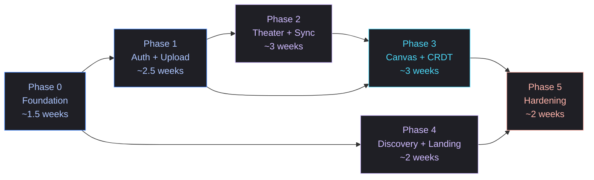
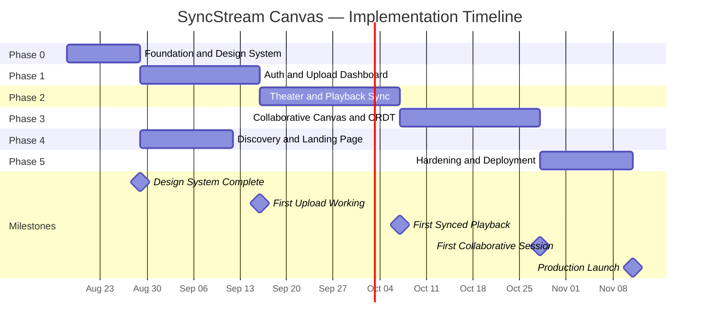

# SyncStream Canvas — Implementation Phases

> **Version:** 1.0  
> **Date:** August 17, 2026  
> **Companion To:** [PRD.md](file:///c:/dev/New%20folder/PRD.md) · [TDD.md](file:///c:/dev/New%20folder/TDD.md) · [AGENTS.md](file:///c:/dev/New%20folder/AGENTS.md)  
> **Estimated Total Duration:** ~14 weeks (solo developer, part-time)

---

## Phase Dependency Graph

**Critical Path:** P0 → P1 → P2 → P3 → P5

---

## Phase 0 — Foundation & Design System (~1.5 weeks)

> **Goal:** Scaffold the project, configure the full design system, and establish the developer environment so every subsequent phase builds on a solid base.

### Deliverables

| # | Task | PRD Refs | TDD Refs |
|---|---|---|---|
| 0.1 | Initialize Next.js 15 project (App Router, TypeScript strict) | — | §2.2 |
| 0.2 | Configure TailwindCSS v4 with full Obsidian Flow design tokens (colors, typography, spacing, border-radius) | PRD §4 | §2.2 |
| 0.3 | Set up Google Fonts (Geist, Inter, JetBrains Mono) with `next/font` optimization | NAV-02 | §3.5 |
| 0.4 | Install Material Symbols Outlined variable font | NAV-04 | §2.2 |
| 0.5 | Create `globals.css` — custom scrollbar, keyframe animations (`reveal`, `pulse`), glass-panel utilities | PRD §4.2 | §3.5 |
| 0.6 | Build primitive UI components: `Button`, `Input`, `Card`, `Badge`, `GlassPanel`, `Avatar` | All screens | §3.5 |
| 0.7 | Build `TopNav` component with brand logo, nav links, icon buttons, avatar | NAV-01–05 | §3.5 |
| 0.8 | Build `MobileNav` bottom bar | NAV-06 | §3.5 |
| 0.9 | Create root `layout.tsx` with font providers, dark mode class, and nav shell | — | — |
| 0.10 | Set up `cn()` utility (clsx + tailwind-merge) | — | — |
| 0.11 | Set up Firebase project (dev) + `.env.local` with config | — | §2.2 |
| 0.12 | Configure Firebase Emulators (Auth, Firestore, Storage) for local dev | — | §6.2 |
| 0.13 | Set up ESLint, Prettier, TypeScript config, `.gitignore` | — | §6.3 |
| 0.14 | Create placeholder route pages: `/`, `/theater/[roomId]`, `/canvas/[roomId]`, `/dashboard`, `/discovery` | PRD §2 | — |

### Acceptance Criteria

- [x] `npm run dev` starts without errors
- [x] All 4 nav links render, active state highlights correctly
- [x] Design tokens match Stitch output (spot-check 5 colors, 3 font sizes, 2 spacing values)
- [x] Glass-panel utility renders correctly with backdrop-blur
- [x] Firebase Emulators start and connect from the app
- [x] `npm run lint` and `npm run build` pass with zero errors

### Risks

> [!NOTE]
> TailwindCSS v4 has breaking changes from v3. If design token config syntax differs, fall back to v3 and migrate later.

---

## Phase 1 — Authentication + Upload Dashboard (~2.5 weeks)

> **Goal:** Users can sign up, log in, upload video files directly to storage, see them processed, and browse their media library.

### Deliverables

| # | Task | PRD Refs | TDD Refs |
|---|---|---|---|
| 1.1 | Integrate Firebase Auth (Google + GitHub + email/password) | — | §3.4 |
| 1.2 | Build `useAuth` hook (sign in, sign out, session state, JWT access) | — | §3.4 |
| 1.3 | Create auth middleware for API routes (verify Firebase JWT) | — | §3.4.4 |
| 1.4 | Write Firestore security rules (users collection, media collection) | — | §3.4.4 |
| 1.5 | Build `POST /api/upload/init` — validates file type/size, returns pre-signed upload URL | DSH-03 | §3.1.1 |
| 1.6 | Build `useUpload` hook — requests pre-signed URL, uploads directly to Cloud Storage, tracks progress | DSH-03 | §3.1.1 |
| 1.7 | Build Upload Dashboard page: header, storage meter, upload dropzone, media grid | DSH-01–06 | §3.1 |
| 1.8 | Build `UploadDropzone` component with drag-and-drop, hover bloom animation | DSH-03 | §3.5 |
| 1.9 | Build `MediaGrid` component with hover reveal overlay (filename, size, last played) | DSH-04–05 | §3.5 |
| 1.10 | Build `StorageMeter` component with gradient progress bar | DSH-02 | — |
| 1.11 | Set up Cloud Run FFmpeg transcoder (Dockerfile + transcode script) | — | §3.1.1 |
| 1.12 | Configure Cloud Storage trigger → transcoding job | — | §3.1.1 |
| 1.13 | Build `POST /api/upload/complete` — updates media status to "ready" | — | §3.1.1 |
| 1.14 | Build `GET /api/media` — returns user's media library from Firestore | DSH-04 | §3.4.1 |
| 1.15 | Write Storage security rules (per-user upload paths, size limits) | — | §3.1.3 |

### Acceptance Criteria

- [ ] User can sign in with Google, see their avatar in the nav
- [ ] User can drag a 100MB MP4 onto the dropzone → file uploads directly to Cloud Storage
- [ ] Upload progress bar shows real-time percentage
- [ ] After upload, transcoder runs and media status becomes "ready" within 2 minutes (for 100MB file)
- [ ] Media grid shows all user's uploaded files with thumbnails
- [ ] Storage meter reflects actual used storage
- [ ] Non-authenticated users are redirected to sign-in
- [ ] Firestore rules tests pass: users can only read/write their own media

### Risks

> [!WARNING]
> **Cloud Run cold starts** may cause the first transcoding job to take 30+ seconds to begin. Set min instances to 1 in production, or accept the delay for dev/staging.

---

## Phase 2 — Theater Mode + Playback Synchronization (~3 weeks)

> **Goal:** Users can create rooms, invite others, and watch pre-uploaded videos in perfect sync with a live chat sidebar.

### Deliverables

| # | Task | PRD Refs | TDD Refs |
|---|---|---|---|
| 2.1 | Build WebSocket server (Node.js + `ws`) with room management | — | §3.2 |
| 2.2 | Implement JWT auth on WebSocket upgrade | — | §3.2.4 |
| 2.3 | Implement host-authority sync protocol (`play`, `pause`, `seek`, `heartbeat`, `sync_check`) | THR-05 | §3.2.1–2 |
| 2.4 | Implement drift correction algorithm (0.5s tolerance / 3s hard seek) | — | §3.2.3 |
| 2.5 | Implement message rate limiting (30 msg/s per client) | — | §3.2.4 |
| 2.6 | Build `useSync` hook (WebSocket client, reconnect with backoff, sync state) | — | §3.2 |
| 2.7 | Build Room API routes: `POST /api/rooms`, `GET /api/rooms/:id`, `PATCH`, `DELETE` | — | §3.4.1 |
| 2.8 | Build `POST /api/rooms/:id/invite` — generate invite links | — | §3.4.1 |
| 2.9 | Build HLS video player component (using hls.js) | THR-01–03 | §3.1 |
| 2.10 | Build floating glass controls bar (play/pause, progress, volume, HD, fullscreen) | THR-04–06 | §3.5 |
| 2.11 | Connect video player to sync protocol (host controls → broadcast → all clients) | THR-05 | §3.2.1 |
| 2.12 | Build Theater sidebar: Live Session header, invite button, participant count | SB-01–03 | §3.2 |
| 2.13 | Build sidebar tab navigation (Chat, Participants, Tools, History) | SB-04 | — |
| 2.14 | Build Chat panel with real-time messages via WebSocket + Firestore persistence | SB-05–06 | §3.2 + §3.4 |
| 2.15 | Build chat input with focus glow and send button | SB-06 | §3.5 |
| 2.16 | Implement presence tracking (join/leave notifications) via Firebase RTDB | SB-02 | §3.4 |
| 2.17 | Write Firestore rules for rooms + messages collections | — | §3.4.4 |
| 2.18 | Dockerize WebSocket server for Cloud Run deployment | — | §6.1 |

### Acceptance Criteria

- [ ] Host creates a room → gets a shareable link
- [ ] Second user joins via link → sees the same video
- [ ] Host presses play → both clients start simultaneously (< 500ms drift)
- [ ] Host seeks to 2:30 → all clients jump to 2:30
- [ ] If a client falls 3+ seconds behind → auto-seeks to catch up
- [ ] Chat messages appear in real-time for all room participants
- [ ] Join/leave events show in chat as system messages
- [ ] Floating controls appear on hover, disappear on mouse leave
- [ ] Video quality switches between 480p/720p/1080p based on bandwidth (HLS adaptive)
- [ ] Unauthorized users cannot send play/pause commands (server rejects)

### Risks

> [!CAUTION]
> **WebSocket servers on Cloud Run** require session affinity and HTTP/2 upgrade support. Verify Cloud Run configuration supports long-lived WebSocket connections. Fallback: deploy on a dedicated VM (Compute Engine) if Cloud Run doesn't cooperate.

---

## Phase 3 — Collaborative Canvas + CRDT (~3 weeks)

> **Goal:** Users can collaborate on an infinite canvas with real-time drawing, media placement, notes, and multi-user cursors — with zero conflict.

### Deliverables

| # | Task | PRD Refs | TDD Refs |
|---|---|---|---|
| 3.1 | Integrate Yjs + y-websocket into the WebSocket server | — | §3.3 |
| 3.2 | Define Yjs document schema (nodes: Y.Map, drawings: Y.Array, cursors: awareness) | CVS-04–05 | §3.3.2 |
| 3.3 | Build `useCanvas` hook (Yjs provider, document state, awareness) | — | §3.3 |
| 3.4 | Build canvas renderer — pannable container with CSS transform, dot-grid background | CVS-01–03 | §3.3 |
| 3.5 | Implement parallax grid movement (grid at 0.5× pan speed) | CVS-02 | §3.3 |
| 3.6 | Build `MediaNode` component (draggable, glassmorphic, hover overlay) | CVS-04 | §3.3 |
| 3.7 | Build `NoteNode` component (glass-panel, editable text, author/timestamp) | CVS-05 | §3.3 |
| 3.8 | Build SVG drawing layer (pen tool → polyline rendering) | CVS-06 | §3.3 |
| 3.9 | Build `CursorOverlay` — renders other users' colored cursors from Yjs awareness | CVS-07–08 | §3.3.3 |
| 3.10 | Implement cursor throttling (50ms debounce, 10s stale cleanup) | — | §3.3.3 |
| 3.11 | Build floating `ToolBar` component (Pen, Text, Media, Note, Shapes) with active glow | TLS-01–04 | §3.5 |
| 3.12 | Build bottom session controls bar (Mic, Camera, Share, Leave) | SC-01–02 | — |
| 3.13 | Implement Yjs document persistence (snapshot to Firestore every 30s + on last leave) | — | §3.3.4 |
| 3.14 | Implement per-room canvas loading (restore from Firestore snapshot on join) | — | §3.3.4 |
| 3.15 | Add Yjs undo/redo support (per-user undo stack) | — | §3.3 |
| 3.16 | Implement canvas node limits (max 50 media nodes, max 5MB per image) | — | §3.3.5 |

### Acceptance Criteria

- [ ] User A draws a line → User B sees it appear within 200ms
- [ ] User A places a note → User B sees the note with correct content and position
- [ ] Both users draw simultaneously on overlapping areas → no data loss, both strokes visible
- [ ] User A sees User B's cyan cursor moving in real-time with name label
- [ ] Canvas pans smoothly with grid parallax effect
- [ ] Tool switching highlights the active tool with bloom glow
- [ ] Canvas state persists — leaving and rejoining the room restores all nodes and drawings
- [ ] Undo works per-user (User A's undo only reverts User A's actions)
- [ ] Canvas rejects upload of 6MB image with error message

### Risks

> [!WARNING]
> **Yjs document size** can grow unbounded in long sessions with heavy drawing. Implement garbage collection (compaction) and consider limiting drawing stroke history to last 1000 strokes per session.

---

## Phase 4 — Discovery Hub + Landing Page (~2 weeks)

> **Goal:** The public-facing Discovery page and marketing landing page are complete, giving the product a polished entry point.

### Deliverables

| # | Task | PRD Refs | TDD Refs |
|---|---|---|---|
| 4.1 | Build Discovery hero section (full-bleed image, gradient overlay, trending badge, CTAs) | DSC-01–05 | §3.5 |
| 4.2 | Build Live Preview Card (glass-panel, video thumbnail, stacked avatars, "LIVE" badge) | DSC-06 | §3.5 |
| 4.3 | Build Active Rooms grid (3-column, room cards with category badges, host info) | DSC-07–11 | §3.4 |
| 4.4 | Implement scroll-triggered reveal animations (Intersection Observer) | DSC-12 | §3.5 |
| 4.5 | Build `GET /api/discovery/trending` and `GET /api/discovery/rooms` endpoints | — | §3.4.1 |
| 4.6 | Build Landing page hero section ("High Fidelity Collaboration.", CTAs) | LND-03 | §3.5 |
| 4.7 | Build Problem section (UDP STREAM DETECTED diagnostic, blurred 720p visual) | LND-04 | §3.5 |
| 4.8 | Build Solution section (4K NATIVE RESOLUTION glow, feature checklist) | LND-05 | §3.5 |
| 4.9 | Implement WebGL shader background (nebula animation, visibility-aware lifecycle) | LND-01 | §3.5.4 |
| 4.10 | Build footer (brand, copyright, links) | LND-07 | — |
| 4.11 | Implement `prefers-reduced-motion` fallbacks for all animations | — | §3.5.5 |
| 4.12 | Add SEO metadata (title, description, OG tags) for landing and discovery pages | — | — |

### Acceptance Criteria

- [ ] Landing page loads in < 2s with shader background animating smoothly
- [ ] Shader pauses when tab is backgrounded, resumes when visible
- [ ] On a device without WebGL → CSS gradient fallback renders instead
- [ ] Discovery shows real active rooms sorted by participant count
- [ ] Room cards animate in on scroll (reveal effect)
- [ ] "JOIN SESSION" on Discovery hero navigates to Theater mode for that room
- [ ] `prefers-reduced-motion: reduce` → no parallax, no shader, minimal transitions
- [ ] Lighthouse SEO score > 90 for landing page

---

## Phase 5 — Hardening, Testing & Deployment (~2 weeks)

> **Goal:** Production-ready. Security hardened, tested, monitored, deployed.

### Deliverables

| # | Task | PRD Refs | TDD Refs |
|---|---|---|---|
| 5.1 | Write unit tests for critical logic: drift correction, sync protocol, Zod schemas, upload validation | — | §3.2.3, §3.1.3 |
| 5.2 | Write integration tests for Firestore security rules (all collections) | — | §3.4.4 |
| 5.3 | Write Playwright e2e tests: sign-in flow, upload flow, room creation, join room | — | — |
| 5.4 | Set up CI pipeline (GitHub Actions): lint, typecheck, test, audit, build | — | §6.3 |
| 5.5 | Configure CSP headers, CORS policy, and rate limiting middleware | — | §5.2 |
| 5.6 | Audit all `npm` dependencies (`npm audit`, remove unused) | — | §5.1 (A06) |
| 5.7 | Add structured logging (Cloud Logging) to WebSocket server and API routes | — | §5.1 (A09) |
| 5.8 | Set up error monitoring (Sentry or similar) for client + server | — | — |
| 5.9 | Performance audit: Lighthouse, WebPageTest. Fix any score < 80 | — | §3.5.1 |
| 5.10 | Deploy frontend to Vercel (staging → production) | — | §6.1 |
| 5.11 | Deploy WebSocket server to Cloud Run (staging → production) | — | §6.1 |
| 5.12 | Deploy transcoder to Cloud Run | — | §6.1 |
| 5.13 | Configure Cloud CDN for processed video delivery | — | §3.1 |
| 5.14 | Write `TESTING.md` documenting test strategy, how to run, coverage targets | — | — |
| 5.15 | Final Firestore + Storage security rules audit before production deploy | — | §3.4.4 |

### Acceptance Criteria

- [ ] All unit tests pass, coverage > 80% on `lib/` directory
- [ ] Firestore rules tests cover: unauthorized read/write rejected, authorized CRUD succeeds
- [ ] e2e tests pass: full sign-in → upload → create room → join → play → chat flow
- [ ] CI pipeline runs in < 5 minutes, all checks green
- [ ] `npm audit` reports zero critical or high vulnerabilities
- [ ] CSP headers block inline scripts and unauthorized origins
- [ ] Production deployment is live and accessible
- [ ] WebSocket server handles 50 concurrent connections without degradation
- [ ] Video plays from CDN with < 2s start time
- [ ] Lighthouse scores: Performance > 80, Accessibility > 90, SEO > 90

---

## Post-Launch Backlog (Future Phases)

These are **out of scope for v1** but documented for future planning:

| Priority | Feature | Notes |
|---|---|---|
| P1 | **Algorithm Visualization Tool** | Canvas tool type for pathfinding/sorting visualizations (ties to JD alignment from `ideas.txt`) |
| P1 | **Mobile-responsive Theater** | Full mobile-optimized Theater layout with touch controls |
| P1 | **Room permissions model** | Granular roles: Host, Co-host, Viewer, Editor |
| P2 | **Video trimming / clipping** | In-browser trim before upload |
| P2 | **Canvas export** | Export canvas as PNG / PDF |
| P2 | **Notification system** | Push notifications for room invites, @mentions in chat |
| P3 | **Content moderation** | Automated NSFW detection on uploads |
| P3 | **Subscription / billing** | Storage tiers, premium rooms |
| P3 | **Offline canvas** | Yjs offline-first with IndexedDB persistence |

---

## Milestone Summary

